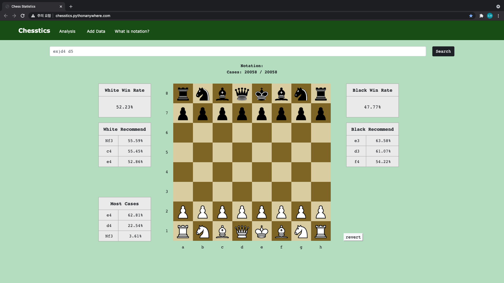
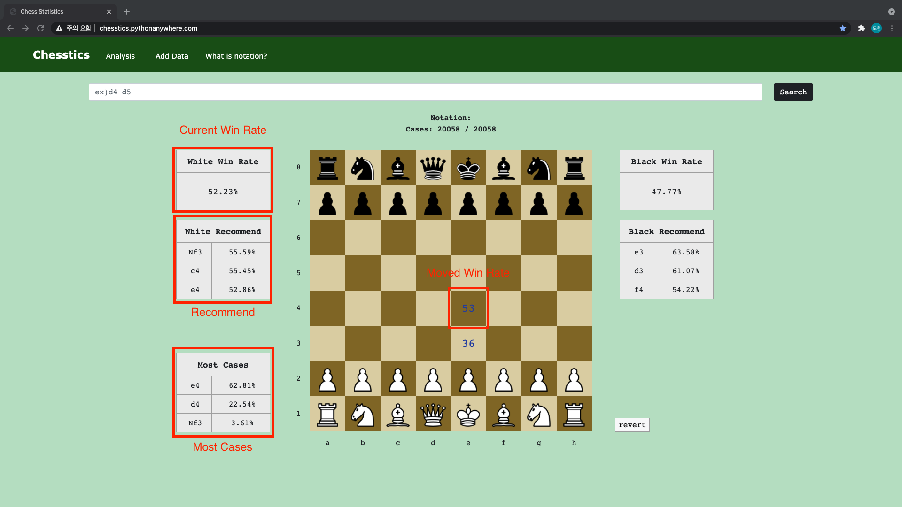
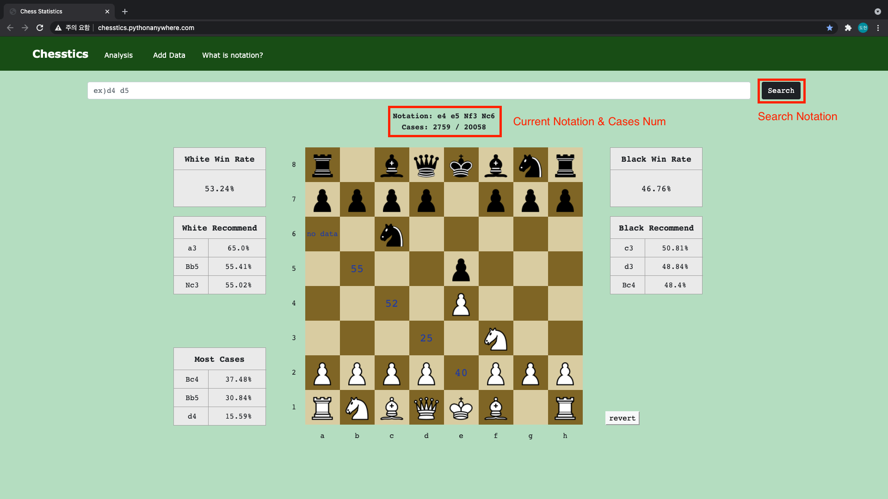
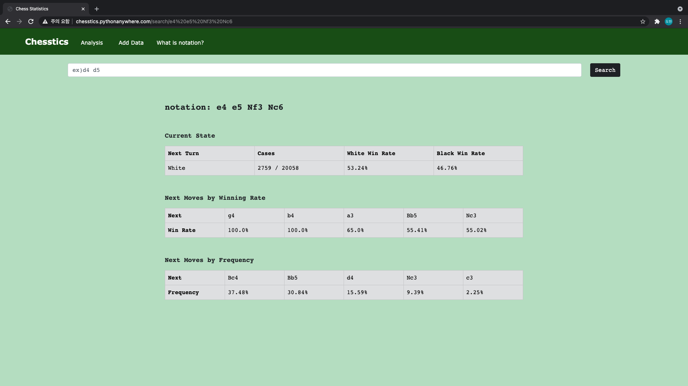

# Chesstics

http://chesstics.pythonanywhere.com/

Chess statistics web application  

Helps you figure out what to do when playing chess  

Made by Django  

[Used Chess Data of Kaggle](https://www.kaggle.com/datasnaek/chess)

# Interface

